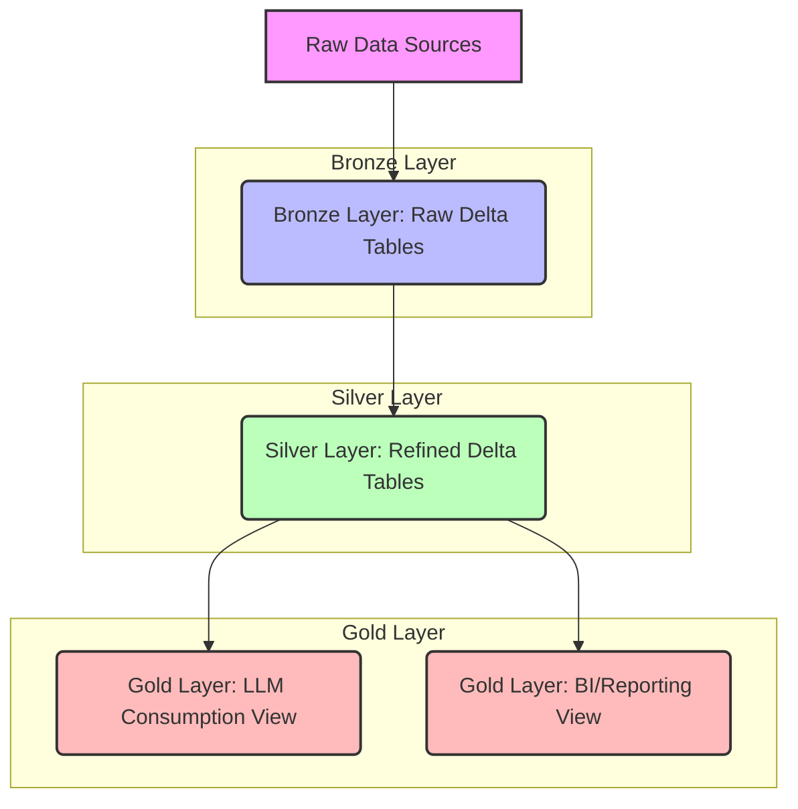

# Data Pipeline Architecture Overview

This document provides a detailed overview of the data pipeline architecture implemented in this Microsoft Fabric project. The core of the architecture is the Medallion Lakehouse pattern, which structures data into three distinct layers: Bronze, Silver, and Gold. This layered approach ensures data quality, governance, and optimized consumption for various downstream applications, including business intelligence and large language models (LLMs).

## Medallion Lakehouse Architecture

The Medallion architecture is a data design pattern that logically organizes data within a lakehouse environment into three main layers, each serving a specific purpose in the data transformation process.

### 1. Bronze Layer (Raw Data Zone)

**Purpose:** The Bronze layer is the initial landing zone for all raw data ingested into the lakehouse. Its primary function is to capture data in its original format without any modifications or transformations. This layer acts as a historical archive and a source of truth for raw data.

**Key Characteristics:**
- **Immutability:** Data in the Bronze layer is immutable. Once written, it is not modified.
- **Fidelity:** Data is stored in its original format, preserving all source system details.
- **Traceability:** Provides a complete historical record of all ingested data, enabling auditing and reprocessing if needed.
- **Schema:** Often schema-on-read, meaning the schema is inferred at the time of reading, or loosely enforced.
- **Data Sources:** Can include various sources like relational databases, streaming data, APIs, and file storage.

**Implementation in Microsoft Fabric:**
- Raw data will be ingested from simulated external sources (e.g., CSV files in Azure Data Lake Storage Gen2, mounted within Fabric).
- PySpark notebooks will read this raw data and write it directly into Delta Lake tables within the Bronze layer. Delta Lake's ACID properties and schema evolution capabilities are beneficial here.

### 2. Silver Layer (Refined Data Zone)

**Purpose:** The Silver layer is where raw data from the Bronze layer is cleaned, transformed, and enriched. This layer aims to provide a consistent, clean, and conformed view of the data, ready for broader consumption across the organization.

**Key Characteristics:**
- **Data Quality:** Focuses on improving data quality through cleansing, deduplication, and standardization.
- **Conformity:** Applies business rules and transformations to create a unified view of entities and events.
- **Schema Enforcement:** Strict schema enforcement ensures data consistency and reliability.
- **Enrichment:** Data can be enriched by joining with other datasets or adding calculated fields.
- **Data Format:** Typically stored in Delta Lake format to leverage its transactional capabilities and performance optimizations.

**Implementation in Microsoft Fabric:**
- PySpark notebooks will read data from the Bronze Delta Lake tables.
- Transformations will include:
    - **Data Type Conversion:** Ensuring data types are consistent and appropriate.
    - **Handling Missing Values:** Imputation or removal of nulls.
    - **Deduplication:** Removing duplicate records.
    - **Standardization:** Formatting data consistently (e.g., date formats, case sensitivity).
    - **Basic Aggregations/Joins:** Combining related data to create a more complete picture.
- The processed and refined data will be written to Delta Lake tables in the Silver layer.

### 3. Gold Layer (Curated Data Zone)

**Purpose:** The Gold layer is the final consumption layer, providing highly curated, aggregated, and denormalized data optimized for specific business use cases. This layer is designed for performance and ease of use by end-users, analysts, and applications.

**Key Characteristics:**
- **Business-Oriented:** Data models are tailored to specific business domains or reporting requirements.
- **Performance Optimized:** Denormalized structures, pre-aggregated metrics, and optimized partitioning for fast query performance.
- **Accessibility:** Easy to consume by various tools and applications, including BI dashboards, analytical tools, and machine learning models.
- **Specific Views:** Often contains specialized views for different consumers.

**Implementation in Microsoft Fabric:**
- PySpark notebooks will read data from the Silver Delta Lake tables.
- Further transformations, aggregations, and denormalizations will be applied to create specific data products.
- Two primary outputs will be generated in this layer:
    - **LLM Consumption View:** A highly denormalized and potentially textual view of the data, optimized for feeding into Large Language Models. This might involve concatenating relevant text fields or summarizing information.
    - **BI/Reporting View:** A star or snowflake schema-like view, optimized for analytical queries and dashboarding. This will include key metrics, dimensions, and pre-calculated aggregates.
- Data will be stored in Delta Lake tables or optimized views within the Gold layer, ensuring efficient access for downstream applications.

## Data Flow Diagram

## Key Pipeline Features Explained

### Idempotency

Idempotency ensures that running the pipeline multiple times with the same input data produces the same result without creating duplicate records or unintended side effects. In this pipeline, idempotency will be primarily achieved using Delta Lake's `MERGE INTO` operation. This allows for upserting data based on a unique key, inserting new records, and updating existing ones without duplication.

### Retry Logic

Transient errors (e.g., network issues, temporary service unavailability) are common in distributed systems. The pipeline will incorporate a utility module (`pipeline_utils.py`) with retry logic to automatically reattempt failed operations a specified number of times with exponential backoff. This enhances the pipeline's resilience and reduces manual intervention.

### Notifications

To ensure operational visibility, the pipeline will send email notifications to `example@email.com` upon successful completion or failure. This proactive alerting mechanism allows for quick identification and resolution of issues, and confirms successful runs.

### PySpark and Microsoft Fabric Notebooks

All data processing logic will be implemented using PySpark within Microsoft Fabric notebooks. This leverages Fabric's integrated analytics capabilities, scalable compute, and collaborative notebook environment for data engineering tasks.

### Configuration-Driven Parameters

Pipeline parameters, such as input/output paths, table names, and notification settings, will be managed through a central `pipeline_config.json` file. This approach promotes flexibility, reusability, and easier management of different environments (e.g., development, staging, production).
