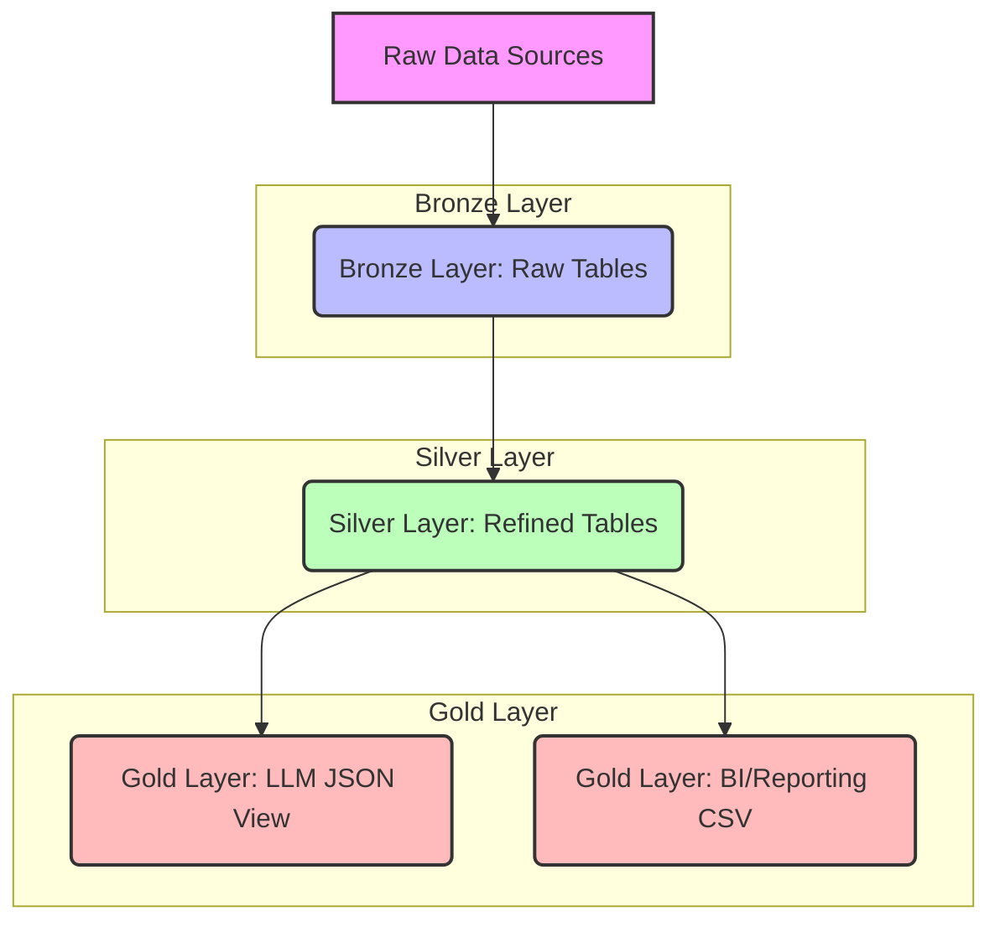

# Data Pipeline Architecture Overview

This document provides a detailed overview of the data pipeline architecture implemented in this project. The core of the architecture is the Medallion Lakehouse pattern, which structures data into three distinct layers: Bronze, Silver, and Gold. This layered approach ensures data quality, governance, and optimized consumption for various downstream applications, including business intelligence and large language models (LLMs).

## Medallion Lakehouse Architecture

The Medallion architecture is a data design pattern that logically organizes data within a lakehouse environment into three main layers, each serving a specific purpose in the data transformation process.

### 1. Bronze Layer (Raw Data Zone)

**Purpose:** The Bronze layer is the initial landing zone for all raw data ingested into the lakehouse. Its primary function is to capture data in its original format without any modifications or transformations. This layer acts as a historical archive and a source of truth for raw data.

**Key Characteristics:**
- **Immutability:** Data in the Bronze layer is immutable. Once written, it is not modified.
- **Fidelity:** Data is stored in its original format, preserving all source system details.
- **Traceability:** Provides a complete historical record of all ingested data, enabling auditing and reprocessing if needed.
- **Schema:** Often schema-on-read, meaning the schema is inferred at the time of reading, or loosely enforced.

**Implementation:**
- Raw data is ingested from CSV files in the `data/` folder.
- Python scripts (`ingest_user_data.py`, `ingest_population_data.py`) read raw data and add metadata.
- Data is stored in DuckDB tables (`bronze_user_data`, `bronze_population_data`).

### 2. Silver Layer (Refined Data Zone)

**Purpose:** The Silver layer is where raw data from the Bronze layer is cleaned, transformed, and enriched. This layer aims to provide a consistent, clean, and conformed view of the data, ready for broader consumption across the organization.

**Key Characteristics:**
- **Data Quality:** Focuses on improving data quality through cleansing, deduplication, and standardization.
- **Conformity:** Applies business rules and transformations to create a unified view of entities and events.
- **Schema Enforcement:** Strict schema enforcement ensures data consistency and reliability.
- **Enrichment:** Data can be enriched by adding calculated fields.

**Implementation:**
- Python script (`silver_layer_processing.py`) reads data from Bronze DuckDB tables.
- Transformations include:
    - **Data Type Conversion:** Ensuring data types are consistent and appropriate.
    - **Standardization:** Formatting data consistently.
- The processed and refined data is written to DuckDB tables in the Silver layer.

### 3. Gold Layer (Curated Data Zone)

**Purpose:** The Gold layer is the final consumption layer, providing highly curated, aggregated, and denormalized data optimized for specific business use cases. This layer is designed for performance and ease of use by end-users, analysts, and applications.

**Key Characteristics:**
- **Business-Oriented:** Data models are tailored to specific business domains or reporting requirements.
- **Performance Optimized:** Denormalized structures and pre-aggregated metrics for fast query performance.
- **Accessibility:** Easy to consume by various tools and applications.

**Implementation:**
- Python script (`gold_layer_processing.py`) reads data from Silver DuckDB tables.
- Further transformations, aggregations, and denormalizations are applied to create specific data products.
- Two primary outputs are generated in this layer:
    - **LLM Consumption View:** A JSON output optimized for feeding into Large Language Models (`llm_view_creation.py`).
    - **BI/Reporting View:** A CSV output optimized for analytical queries and dashboarding (`reporting_view_creation.py`).

## Data Flow Diagram

## Key Pipeline Features Explained

### Idempotency

Idempotency ensures that running the pipeline multiple times with the same input data produces the same result without creating duplicate records. In this pipeline, idempotency is achieved using DuckDB's PRIMARY KEY constraints and INSERT...ON CONFLICT logic.

### Local Execution with DuckDB

The pipeline runs locally using DuckDB as a lightweight embedded database. This makes it easy to develop and test without cloud infrastructure (Azure or Microsoft Fabric).

### Configuration-Driven Parameters

Pipeline parameters, such as input/output paths, table names, and notification settings, are managed through a central `pipeline_config.json` file.

### Output Files

The pipeline generates output files in the `output/` folder:
- `gold_llm_demographic_summary.json` - Optimized for LLM ingestion
- `gold_user_demographics.csv` - Aggregated user data
- `gold_population_stats.csv` - Aggregated population data
- `gold_reporting_demographic_summary.csv` - BI/Reporting view
